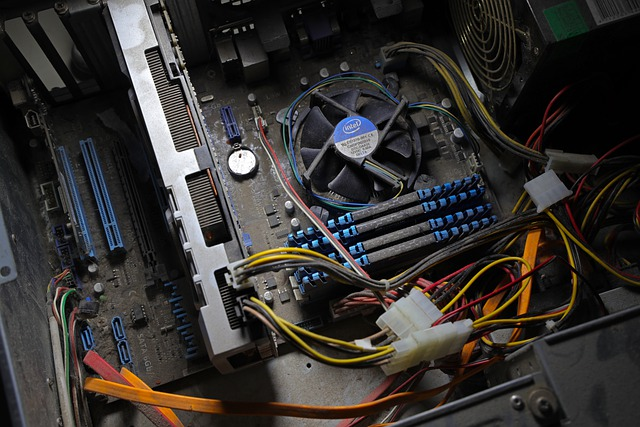

***

In your career as an IT Support Technician or IT Helpdesk Technician, you will encounter a lot of problems and how you approach each problem will determine your career growth in the industry.

The least effective type of IT Helpdesk Technician is a **“gun slinger.”** The term gun
slinger brings to mind images of Wild West ruffians who had shooting matches
with other gangsters in the town’s main street. Gun slingers drew their guns
frequently and with little provocation. They did not put much thought into their
method or consider other possible resolutions. You must strive not to be this
type of technician.

***

***

A gun slinger technician changes multiple things simultaneously. For
example, if there is no display on the output, the technician might swap out the
monitor, disable the onboard video port, add a new video adapter, power on the
computer, and, when output appears, call the problem “solved.” If a computer
problem is repaired using such a technique, the technician never knows exactly
what solved the problem. A gun slinger technician might get frustrated easily
because it is easy to forget what has been tried when multiple things have been tried simultaneously—and it is almost impossible to know which one worked.

***

***

A good technician, on the other hand, makes a list of symptoms (even if it is
simply a mental list) followed by a list of things to try. Then the technician tries
the possible solutions, starting with the simplest one (the one that costs the
least amount of time to the computer user). The technician documents each
step. After each approach that does not fix the problem, the technician puts the
system back to the original configuration before attempting the next possible
solution. This method keeps the technician focused on what has been tested,
and if another technician takes over, the steps do not have to be repeated. Best
of all, when one of the possible solutions fixes the problem, the exact solution is
known.

Gun slinger technicians do not learn as fast as other technicians because
they do not determine the real causes of problems. Each time they are
presented with a problem similar to one they have seen in the past, gun slinger
technicians use the same haphazard troubleshooting method. These
technicians are actually dangerous to an organization because they are not
good at documenting what they have done and determining exactly what fixes a
particular problem. A good computer technician should methodically
troubleshoot a problem by making only one change at a time and reverting the
change if the change does not solve the problem. Furthermore, the technician
needs to document the issue and its resolution for future problems.

***
_Extract from Complete A+ Guide to IT Harrdware and Software by Cherly A. Schmidt_
