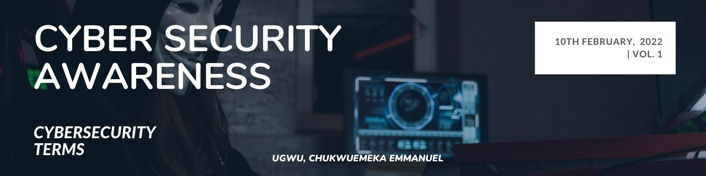

<table class="styled-table">
  <thead>
    <tr>
      <th>"You can build the world's best security systems, but they won't protect you if the users are going to be practicing Unsafe Security"</th>
      <th>What i will do with the Scholarship</th>
    </tr>
  </thead>
  <tbody>
  <tr>
      <td> 
        
      </td>
      <td>
        I know you may not be aware of these habits and the fact that any of your account has not been compromised does not mean you are safe for it is only a matter of time.
        I am not trying to scare you in anyway but the following recommendations will further reduce the threat vector.
        Password salting: This is a process of strengthening account password, a good password MUST contain at least 8-characters, an uppercase and an alphanumeric character.
        Password Reuse: Financial account password MUST be unique from any other password we use but due to our flaws in remembering multiple passwords, it has become a common practice to reuse password.
        Two Factor Authentication (2FA): This is an additional layer of protection to the password which can be applied to financial accounts.</td>
    </tr>
    <tr>
      <td>
        The biggest threat in any security infrastructure is you and I, we are the weakest link and overtime through a method called Social Engineering we have unknowingly giving away information that can be used to penetrate our IT security systems.
        Social Engineering: is the psychological manipulation of people into performing actions or divulging confidential information.
        As we reflect on the training held on the 26th June, let us not forget that we are at a greater risk of having our accounts compromised if we are fond of the following habits:
        Password reuse: This is not a good security practice as this will increase your threat vector and put you in a precarious situation if any of the services where you are registered with such an account is ever compromised.
    </td>
      <td> 
        
      </td>
    </tr>
    <tr>
      <td> 
        
      </td>
      <td>
        Name and birthday combination: Another unsafe security practice that is very common is the use of name and birth date combination as a password, you are at a higher risk of dictionary attack and your passwords can easily be guessed by a hacker.
        Password Sharing: Password is a piece of information that should be kept confidential and when you unintentionally leave your password on a piece of paper or share them with people you are leaving our accounts vulnerable.
        You are in a greater risk if you are culpable of these habits and you are advised to imbibe a good security practice.
      </td>
    </tr>
    
  </tbody>
</table>

  

  

