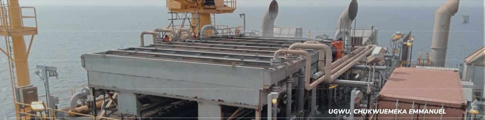
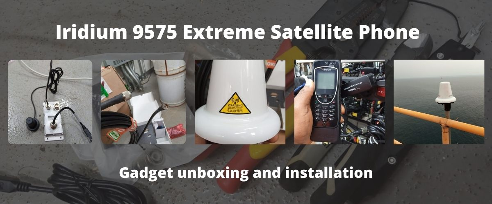

***

As I recall the desert battle scene on Transformer 2 (Revenge of the fallen), where captain Epps was speaking with Lennox who was commanding the drone operation that was providing air strike support against the decepticons, I recalled he was making use of a handset with a long antenna and ever since then, I have often wondered how this was possible, as this goes against my basic knowledge about how telecommunication worked, I have witnessed the queues at phone booth from recharging your Nitel card to the deskphone and now mobile phones and what was common among them was the significant presence of wires and masts. I was told that such services are not easily available, especially in deserts, in fact, Agu Ugbogu in my village still does not have network coverage and I recall how we climbed trees just to access network coverage in the 2000s.

Today, I had the privilege to unbox and setup an Iridium 9575 Satellite phone in Okume Charly. I know you might be wondering why such piece of equipment is needed. Well, this is for emergencies only as the tariff is not pocket friendly

***

This phone comes with the following features:

- Allowing you to make and receive phone calls anywhere in the world. The phone offers an integrated speakerphone and hands-free capability through a headset included as a standard

- SMS and email enabled, allowing you to stay in touch and share experiences with others anywhere in the world. SMS and email messaging is limited to 160 characters and delivery/receipt is dependent on compatibility with local mobile network carriers

- Programmable emergency button that activates critical, rapid response when you need it most. It is the only satellite phone currently available with emergency services supported by GEOS International Emergency Response Coordinating Centre included at no additional cost.

- Equipped with Location Based Services (LBS) enabling GPS positioning. Allows you pinpoint and share your coordinates from anywhere on the globe.

- Designed to withstand the harshest weather conditions. It is jet water resistant, shock resistant, dust proof and has a rugged antenna for unparalleled durability.

The phone will automatically register on the satellite when in an open sky, but when it is needed in the shelter area, an external antenna is setup outside in a position with clear sky and that signal is captured via coaxial cables and extended to the shelter where the phone can access it with its docking station. For all installation instructions, refer to the manual here.
