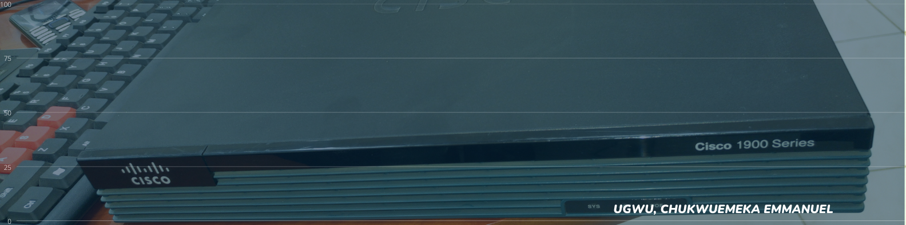
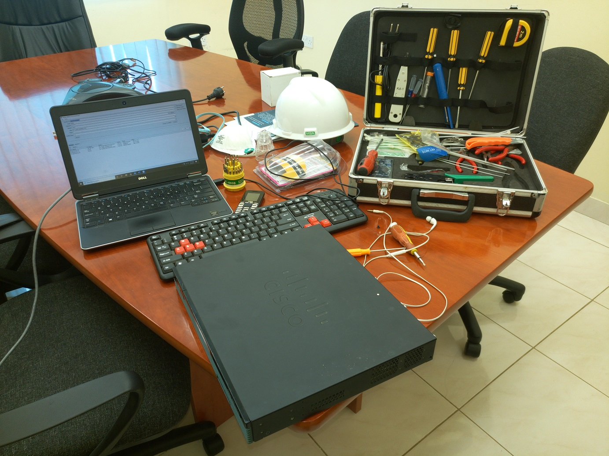
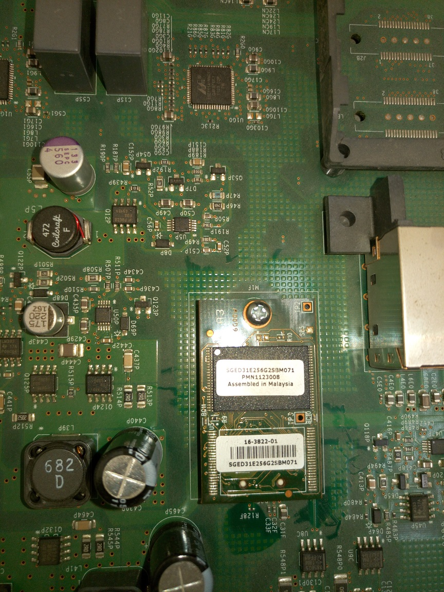
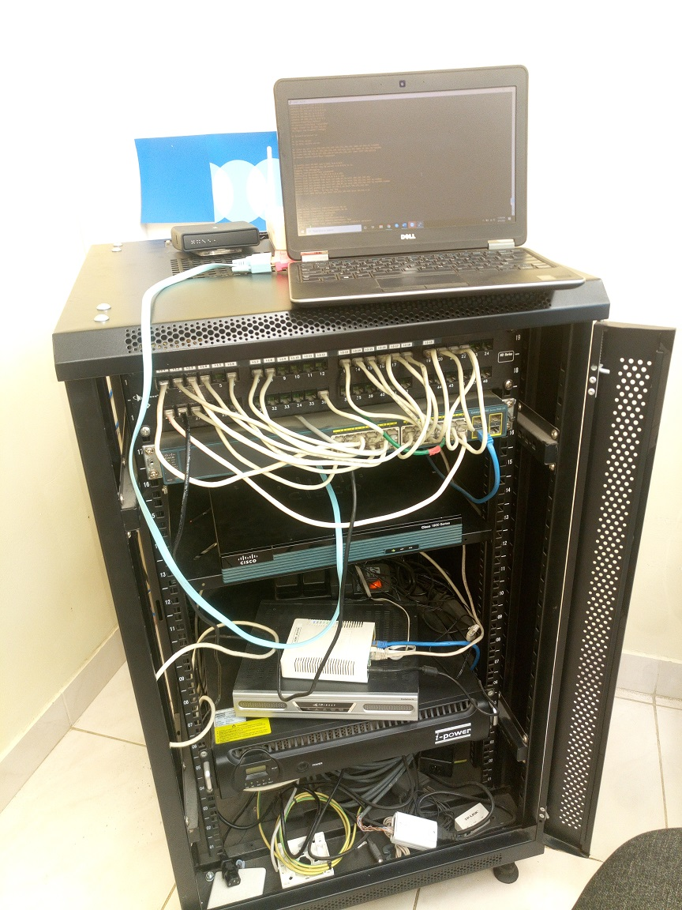

***

We had a scheduled migration from one domain to another and the Network Engineer who configured this router had already left the company and no one had an idea where the configuration documentation for the devices was kept. By domain migration, I mean when a current company lets call it company A with all its infrastructure and network architecture is being acquired by another company B and all its current configurations and IT devices needs to be migrated to reflect the new company. In order for company B to apply all its IT policies and grant users access to IT services, this migration has to be done.

We tried to recover the password from the ROMMON mode but the device was not initializing the ROMMON mode. We tried all the methods available online and non was helpful, ended up spending the whole day with no success. My manager had to consult with the more experienced Network Engineer who revealed to him that this device came with a software bug that is blocking the ROMMON mode from initializing.
I thought I would share how we eventually solved the problem and my learnings in the process.

***

**NOTE: Cisco does not advice tampering with its devices and it will be in your best interest to seek the expertise of professionals to help you out in this type of scenario.**

- You need a size 10 Torx screwdriver, a star screwdriver and antistatic wrist strap to prevent damaging the flash with static currents from our hands. You also need a console cable and of course a laptop with Putty application.

- Power down the device and unplug from power. Place it on a table or any flat solid surface.

- With the torx screwdrivers, loose the 4 screws by the side of router and gently press on the top and slide in the forward position towards the green plastic to pop open the router.

***
- Locate the flash on the mother, use a screwdriver and carefully lift it off from the mother board.

- Connect the power cable and power on the router.

- After booting, the device will fall back to the ROMMON and you can execute these commands

> - Configreg 0x2142

  - Reload

- After reloading, it will show an error, no flash. Ignore this, power off the router and remove the power cable.

***

- Install the flash back on the motherboard and couple the router.

- Power on the router, rack it and continue configuring the device like it’s the first time.

***
