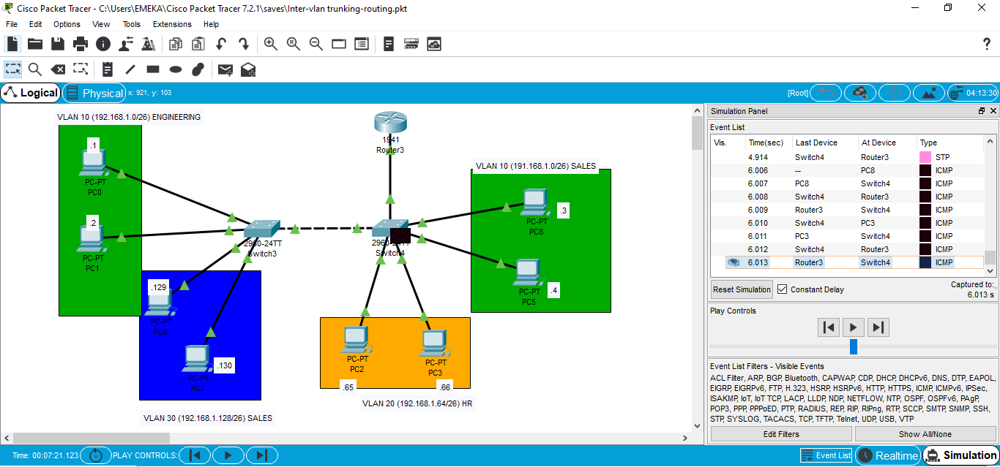
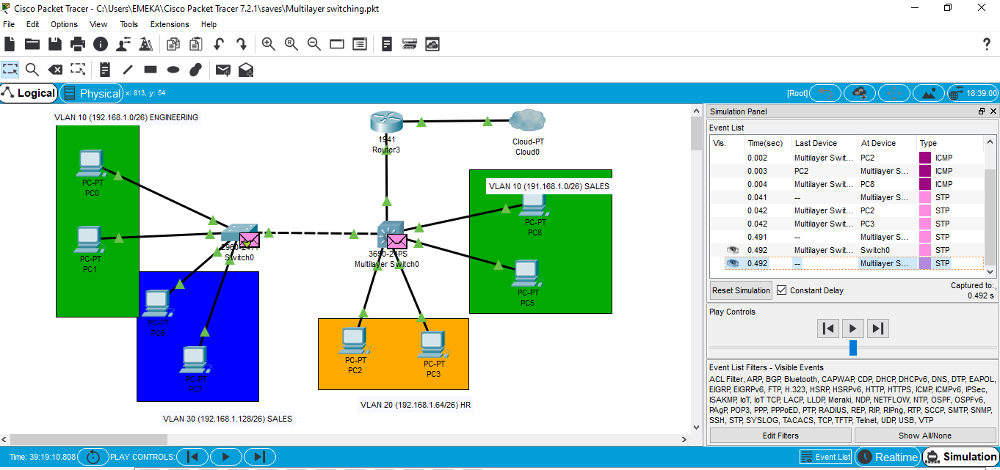

From my networking class, Switch was defined primarily as a layer 2 device that identifies devices connected to it based on their MAC addresses and forwards traffic based on this table (MAC Address table). While a majority of the Cisco based switches support VLANs, the network administrator will still need to configure a Router to route traffic between the VLANs from a layer 2 switch.

***

If it's your first time hearing about Multilayer switching like me, do not worry because you are definitely not alone. Imagine you are running a big company of about a thousand employees and you have no assistant whom you can push some of the responsibilities to and everyone in the company has to come to you for every trivial issue? This is the case when a router has to also perform inter-vlan routing on a network as well as its primary task of routing traffic between networks. Basically, a MLS enables hardware-based Layer 3 switching to offload routers from forwarding unicast IP data packets, when you have departmental heads making decisions in those departments and not necessarily involving you in every tiny detail will free up your time and also help you to become more productive. This is exactly the advantage the MLS brings in a network.
MLS does not come with default configs to route VLAN traffic, this feature has to be enabled and configured by the network administrator to enable this device to function in this capacity and my lab today will be demonstrating the key components to achieve this functionality.

***

### Below is the running config on the MLS from the diagram.

~~~
MLSW#sh run
Building configuration...

Current configuration : 2117 bytes
!
version 16.3.2
no service timestamps log datetime msec
no service timestamps debug datetime msec
no service password-encryption
!
hostname MLSW
!
no ip cef
ip routing
!
no ipv6 cef
!
!
spanning-tree mode pvst
!
interface GigabitEthernet1/0/1
no switchport
ip address 192.168.1.193 255.255.255.252
duplex auto
speed auto
!
interface GigabitEthernet1/0/2
switchport trunk allowed vlan 10,30
switchport trunk encapsulation dot1q
!
interface GigabitEthernet1/0/3
switchport access vlan 20
switchport mode access
switchport nonegotiate
!
interface GigabitEthernet1/0/4
switchport access vlan 20
switchport mode access
switchport nonegotiate
!
interface GigabitEthernet1/0/5
switchport access vlan 10
switchport mode access
switchport nonegotiate
!
interface GigabitEthernet1/0/6
switchport access vlan 10
switchport mode access
switchport nonegotiate
!
interface GigabitEthernet1/0/7
!
.
.
.
interface GigabitEthernet1/1/4
!
interface Vlan1
no ip address
shutdown
!
interface Vlan10
mac-address 0001.c9bc.d601
ip address 192.168.1.62 255.255.255.192
!
interface Vlan20
mac-address 0001.c9bc.d602
ip address 192.168.1.126 255.255.255.192
!
interface Vlan30
mac-address 0001.c9bc.d603
ip address 192.168.1.190 255.255.255.192
!
ip classless
ip route 0.0.0.0 0.0.0.0 192.168.1.194 
~~~